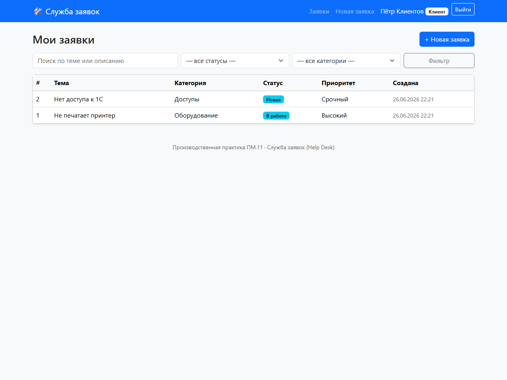

# 🛠 Служба заявок (Help Desk)

[](https://qlty.sh/gh/asbsb21/projects/helpdesk)


> Производственная практика **ПМ.11 «Разработка, администрирование и защита баз данных»**
> Специальность 09.02.07 «Информационные системы и программирование», АНПОО «Хекслет колледж».

Веб-приложение службы технической поддержки: пользователи создают заявки, агенты их обрабатывают
(статусы, приоритеты, исполнители, переписка), администратор управляет пользователями, ролями
и справочниками. Реализованы авторизация, три роли (клиент / агент / администратор) и разграничение
доступа к данным.

- 🔗 **Проект из каталога:** [project-based-learning → Build a Help Desk / Ticketing system](https://github.com/practical-tutorials/project-based-learning) *(укажите точный пункт каталога)*
- 🌐 **Деплой:** `TODO: https://<app>.onrender.com` *(добавить после деплоя)*
- 🎥 **Демонстрация:** GIF ниже ↓

## Демонстрация

Сценарий: клиент создаёт заявку → агент берёт её в работу, меняет статус и отвечает в переписке.



## Стек

| Слой | Технологии |
|------|------------|
| Backend | Python 3.12, Django 5.2 |
| Frontend | Django Templates + Bootstrap 5 |
| База данных | PostgreSQL (прод) / SQLite (локально) |
| Деплой | Render, Gunicorn, WhiteNoise |

## Возможности

- Регистрация и авторизация пользователей, хеширование паролей.
- Три роли с разными правами: **клиент**, **агент**, **администратор**.
- CRUD заявок: тема, описание, категория, приоритет, статус, исполнитель, метки.
- Переписка по заявке (комментарии), внутренние комментарии для сотрудников.
- Фильтрация и поиск заявок по статусу, категории и тексту.
- Разграничение доступа: клиент видит только свои заявки, агент — все.
- Встроенная админ-панель Django для администрирования БД и справочников.
- Автоматическая фиксация даты закрытия заявки.

## Локальный запуск

```bash
# 1. Клонировать репозиторий и перейти в папку
git clone <repo-url> && cd <repo>

# 2. Создать и активировать виртуальное окружение
python -m venv .venv
source .venv/bin/activate        # Windows: .venv\Scripts\activate

# 3. Установить зависимости
pip install -r requirements.txt

# 4. Применить миграции и загрузить тестовые данные
python manage.py migrate
python manage.py seed

# 5. Запустить сервер
python manage.py runserver
```

Приложение: http://127.0.0.1:8000/

## Тестовые аккаунты

| Логин | Пароль | Роль |
|-------|--------|------|
| `admin` | `admin12345` | Администратор |
| `agent` | `agent12345` | Агент |
| `client` | `client12345` | Клиент |

## Тесты

```bash
python manage.py test
```

## Структура проекта

```
.
├── config/                 # настройки и корневые URL Django
├── helpdesk/               # основное приложение
│   ├── models.py           # модели БД (User, Ticket, Comment, справочники)
│   ├── views.py            # представления (список, карточка, создание, обработка)
│   ├── forms.py            # формы (регистрация, заявка, комментарий)
│   ├── admin.py            # настройка админ-панели
│   ├── tests.py            # автотесты (модели, доступ, сценарии)
│   └── management/commands/seed.py   # генерация тестовых данных
├── templates/              # шаблоны (base, вход, регистрация)
├── docs/                   # ERD и диаграммы
├── requirements.txt
├── render.yaml             # конфигурация деплоя на Render
└── build.sh                # скрипт сборки на деплое
```

## Документация

- [ERD и описание модели данных](docs/ERD.md)

---

*Архитектура: `Браузер → Django (views + templates) → ORM → PostgreSQL`.*
