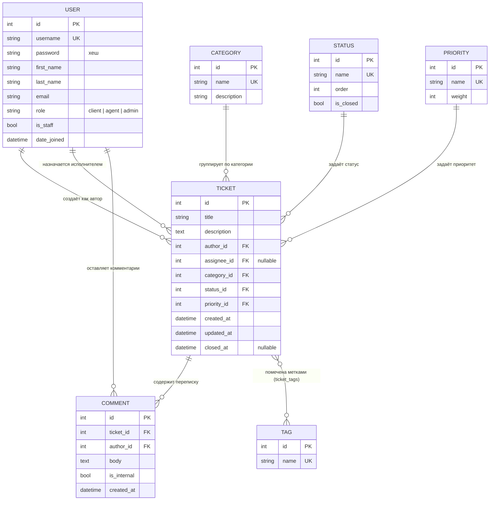

# Модель данных (ERD) — Служба заявок

Диаграмма отражает реальную схему БД проекта (приложение `helpdesk`).

## Сущности и назначение

| Таблица | Назначение | Ключевые связи |
|---------|------------|----------------|
| `helpdesk_user` | Учётные записи с ролью (client / agent / admin). Пароль хранится в виде хеша. | 1:N к Ticket (как автор и как исполнитель), 1:N к Comment |
| `helpdesk_category` | Справочник категорий заявок | 1:N к Ticket |
| `helpdesk_status` | Справочник статусов; `is_closed` помечает закрывающие | 1:N к Ticket |
| `helpdesk_priority` | Справочник приоритетов; `weight` — для сортировки | 1:N к Ticket |
| `helpdesk_tag` | Метки заявок | M:N к Ticket |
| `helpdesk_ticket` | Заявка — центральная сущность | FK на User×2, Category, Status, Priority; M:N с Tag |
| `helpdesk_comment` | Переписка по заявке; `is_internal` — внутренние записи для агентов | FK на Ticket и User |
| `helpdesk_ticket_tags` | Связующая таблица «многие-ко-многим» Ticket↔Tag | — |

## Нормализация

- **1НФ** — все поля атомарны; множественные метки вынесены в `tag` + `ticket_tags`.
- **2НФ** — справочники (status, priority, category) отдельны; в `ticket` хранятся только FK.
- **3НФ** — нет транзитивных зависимостей: данные пользователя не дублируются в заявках/комментариях.

## Роли и права (администрирование)

| Действие | client | agent | admin |
|----------|:------:|:-----:|:-----:|
| Создать заявку / комментировать | ✅ | ✅ | ✅ |
| Видеть свои заявки | ✅ | ✅ | ✅ |
| Видеть все заявки | ❌ | ✅ | ✅ |
| Менять статус / приоритет / исполнителя | ❌ | ✅ | ✅ |
| Внутренние комментарии | ❌ | ✅ | ✅ |
| Управление пользователями и справочниками (админка) | ❌ | ❌ | ✅ |
